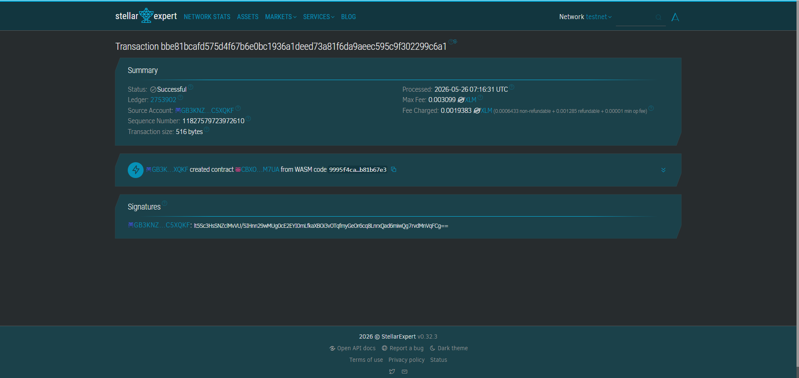

# Ligtas Link

# CONTRACT ID
CBXO3UVP3NVON7XCA4LOEEHF3MWGHUAD5MA4IEZSMUOHBHCFCDWMM7UA

# CONTRACT LINK
https://stellar.expert/explorer/testnet/tx/bbe81bcafd575d4f67b6e0bc1936a1deed73a81f6da9aeec595c9f302299c6a1



A decentralized oracle-driven parametric micro-insurance climate escrow dApp delivering instantaneous automated disaster relief payouts to rural agricultural cooperatives across the Philippines via Soroban.

## Problem & Solution
Agricultural and coastal communities across the Philippines face frequent severe typhoons, while legacy insurance options remain slow and mired in manual claims processing. **Ligtas Link** modernizes this safety net by securing policy payouts inside an automated Soroban smart contract escrow. Payouts clear instantly to connected wallets the moment objective data oracles verify that regional wind speeds have crossed catastrophic thresholds.

## Project Framework
- **Timeline:** 3-week bootcamp timeline
- **Stellar Features Used:** Soroban Smart Contracts, Stellar-native USDC, Weather Index-Based Oracle Integrations

## Vision and Purpose
To protect vulnerable rural populations from post-disaster debt traps by turning legacy insurance paperwork loops into fast, transparent, and direct climate resilience assets.

## Prerequisites
- Rust (v1.75+)
- Soroban CLI (v20.0.0+)
- Target: `wasm32-unknown-unknown`

## Build Instructions
```bash
soroban contract build
